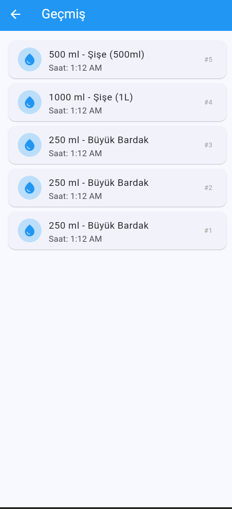
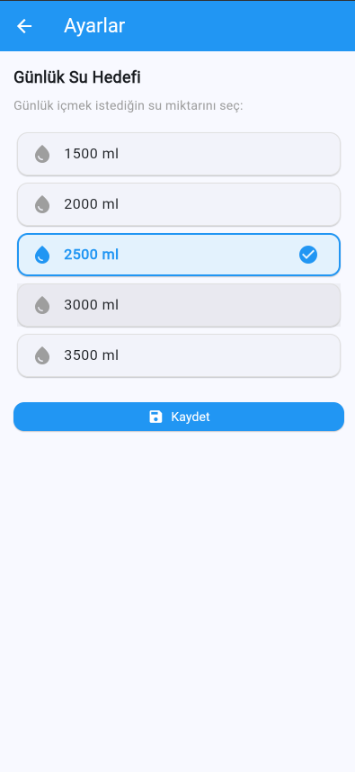

# 💧 Drink Water Reminder

Günlük su içme alışkanlığını takip etmeni sağlayan Flutter ile geliştirilmiş mobil uygulama.

## 📱 Özellikler

- Günlük su içme hedefi belirleme
- Hızlı su ekleme (150ml, 250ml, 500ml, 1L)
- Dairesel ilerleme göstergesi
- İçme geçmişi takibi
- Sayfa geçişleri (Navigator + Named Routes)
- Route Arguments ile veri taşıma

## 🛠️ Kullanılan Teknolojiler

- Flutter SDK (3.x)
- Dart
- Material Design 3

## 🚀 Çalıştırma Adımları

1. Flutter SDK kurulu olduğundan emin ol
2. Repoyu klonla:
```
   git clone https://github.com/benmevic/drink-water-reminder-react.git
```
3. Klasöre gir:
```
   cd drink-water-reminder-react
```
4. Bağımlılıkları yükle:
```
   flutter pub get
```
5. Uygulamayı çalıştır:
```
   flutter run
```

## 📸 Ekran Görüntüleri





## 👩‍💻 Geliştirici

Meriç Aytaş
