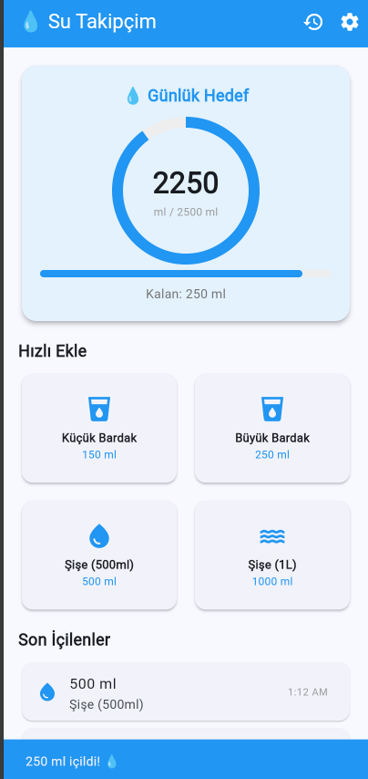

# 🛍️ Mini Katalog Uygulaması

Flutter ile geliştirilmiş minimalist ve modern bir ürün katalog uygulaması.

## 📱 Özellikler

- Ürün listeleme (GridView)
- Kategoriye göre filtreleme
- Ürün arama
- Ürün detay sayfası
- Sepete ekleme ve sepet yönetimi
- Sayfa geçişleri (Navigator + Named Routes)
- Basit state güncelleme

## 🛠️ Kullanılan Teknolojiler

- Flutter SDK (3.x)
- Dart
- Material Design 3

## 🚀 Çalıştırma Adımları

1. Flutter SDK kurulu olduğundan emin ol
2. Repoyu klonla:
```
   git clone https://github.com/benmevic/mini-katalog-react.git
```
3. Klasöre gir:
```
   cd mini-katalog-react
```
4. Bağımlılıkları yükle:
```
   flutter pub get
```
5. Uygulamayı çalıştır:
```
   flutter run
```

## 📸 Ekran Görüntüleri




## 👩‍💻 Geliştirici

Meriç Aytaş.